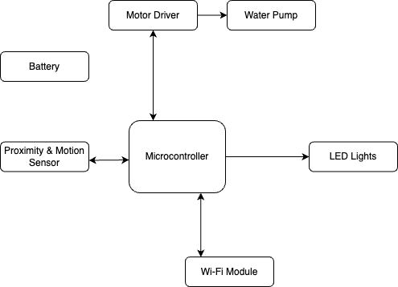
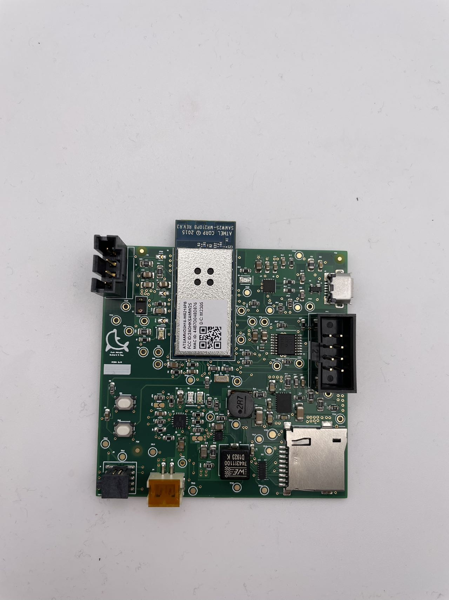
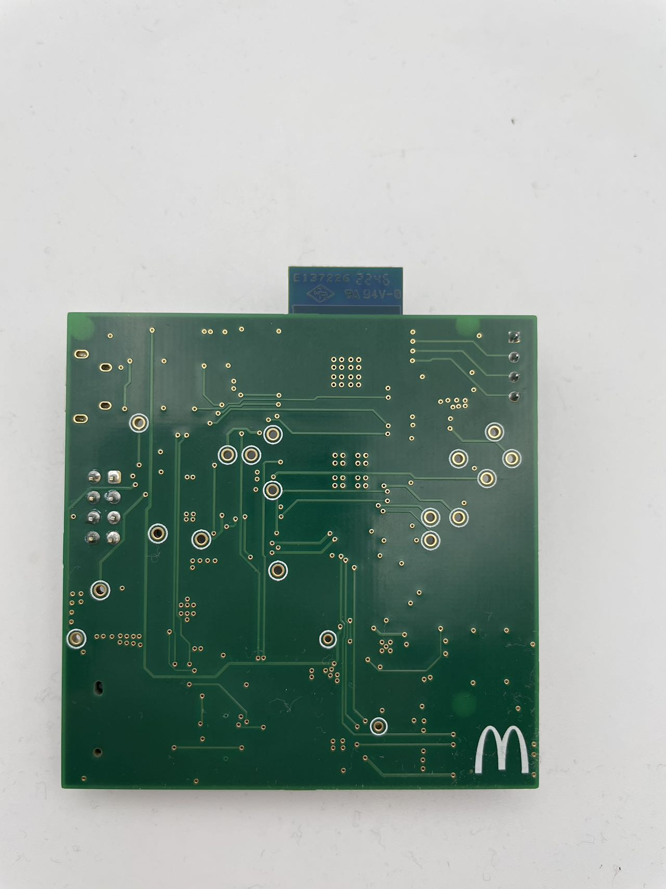
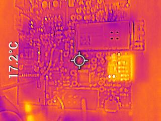
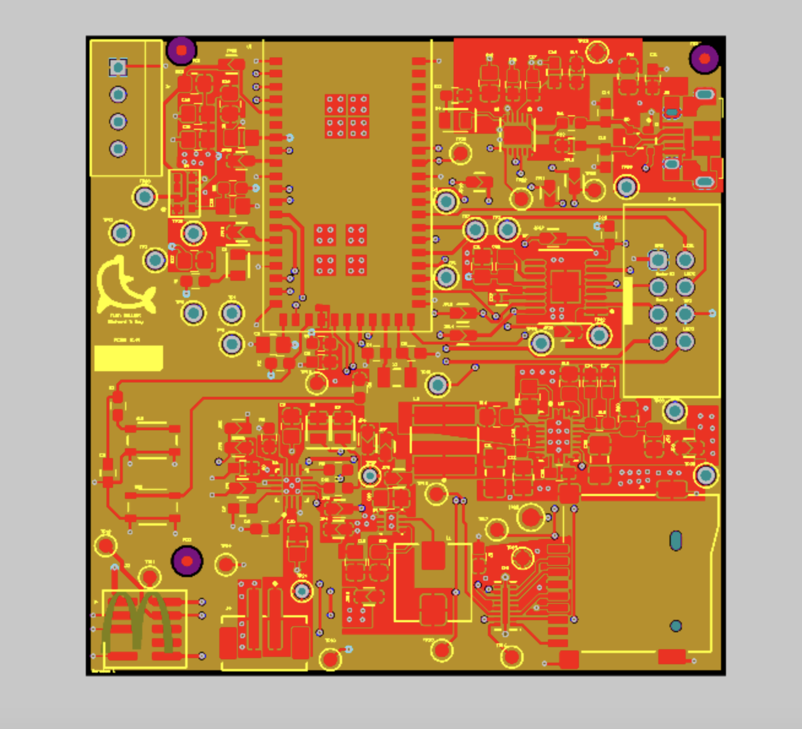
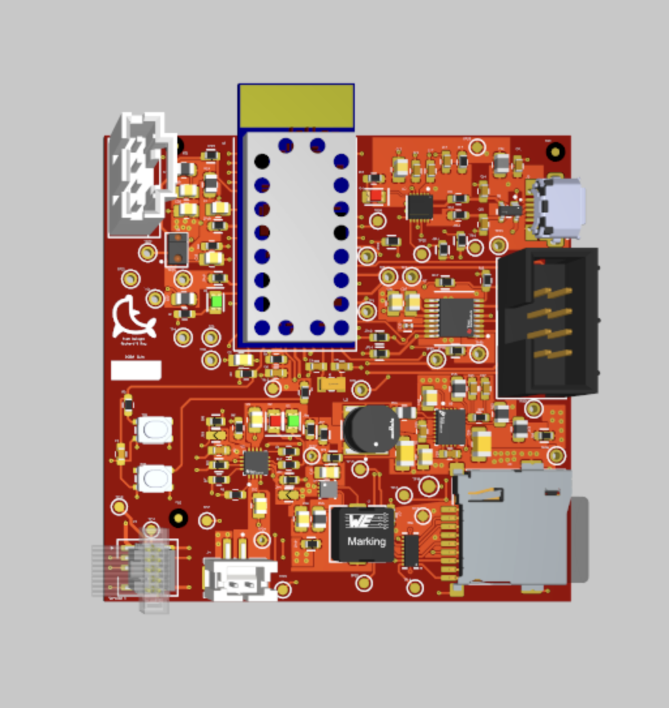
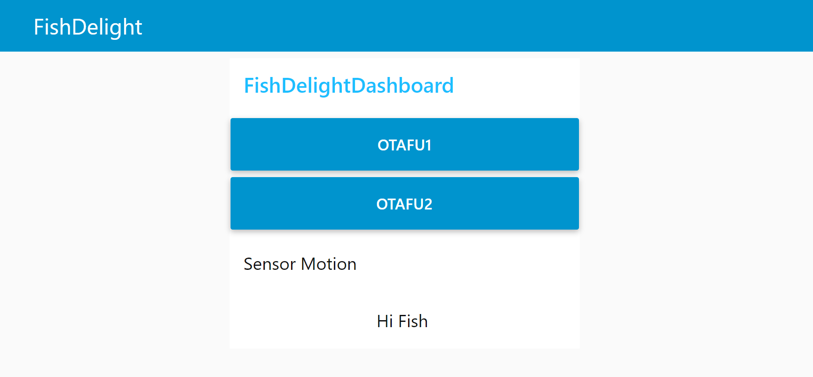
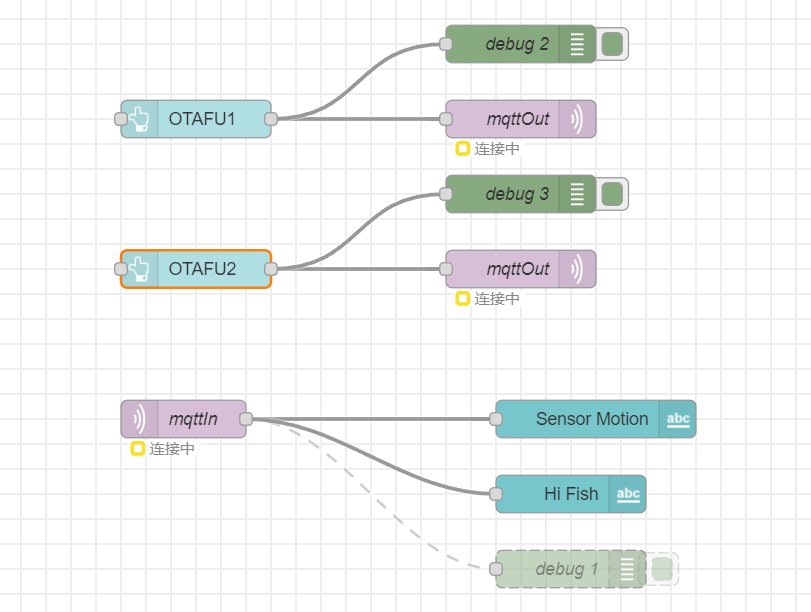
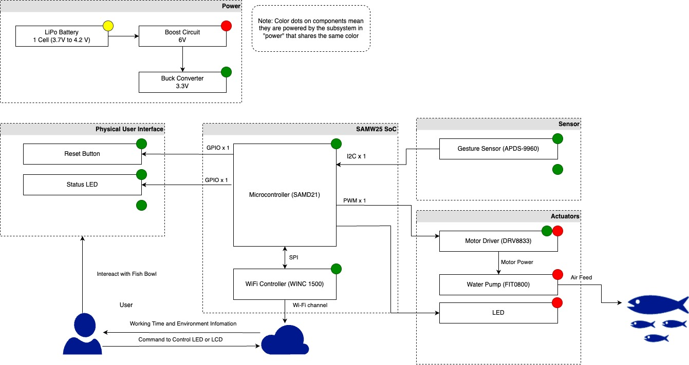

# a14g-final-submission

    * Team Number: #10
    * Team Name: Fish Delight
    * Team Members: Jiarui Bi, Yuqi Yang
    * Github Repository URL: https://github.com/ese5160/a14g-final-submission-t10-fish-delight/main
    * Description of test hardware: board + sensor + acturator

## 1. Video Presentation
[FishDelight Demonstration](https://drive.google.com/file/d/1TBw26h3v0m9ngAQYDI2oFyIDSj1BkLVK/view?usp=sharing)

## 2. Project Summary

Device Description

Our project, Fish Delight, reimagines the concept of an IoT-enabled desktop fishbowl, offering more than mere aesthetics. Designed to address the mental strain and fatigue that often accompany prolonged office work, Fish Delight serves as a calming and engaging distraction. By enabling intuitive hand motion controls through advanced proximity and motion sensors, it allows office employees to interact with their environment in a refreshingly playful manner. This interactive fishbowl activates features such as a water fountain and a variety of LED displays in response to hand movements, providing visual delight and mental relaxation. The addition of an Internet-connected interface enhances Fish Delight’s functionality significantly. Through a dedicated webpage, users can effortlessly update the embedded hardware's code, allowing for a continuous refresh of LED modes and interactions. This feature not only enhances user engagement but also ensures that the device remains a dynamic and adaptable element of the workspace. With its stylish design and cutting-edge technology, Fish Delight is more than just a decorative item; it's a portal to a more relaxed, creative office atmosphere.

### Inspiration

The inspiration behind Fish Delight came from our own experiences working long hours in an office. We noticed how a monotonous environment can really drain your spirit. Looking for a way to add a little spark to the typical office setup, we thought about what makes a space lively yet soothing. That's when we landed on the idea of a fishbowl—not just any fishbowl, but one that interacts with you. We wanted to create something that not only beautifies the desk but also interacts with its owner in a meaningful way, breaking the monotony with a bit of magic. The motion-activated features that bring Fish Delight to life are designed to offer a playful break from the daily routine, engaging both the mind and the senses. Plus, the ability to update and customize the settings via the Internet keeps everything fresh and exciting. It’s all about turning the everyday into something extraordinary.

### Device Functionality
Fish Delight harnesses the precision of hand motion detection to activate and control various functions, enriching the user experience with intuitive gesture-based interaction. The device features a sophisticated gesture sensor (APDS-9960) which captures hand movements, enabling users to effortlessly switch between different operational modes. Users can turn the water fountain on or off and select from a variety of LED modes, including blinking, running, and static displays, all through simple hand gestures. The device is powered efficiently through a well-designed circuit that includes both a 6V boost converter and a 3.3V buck converter. This power regulation system ensures that all components, from the gesture sensors to the LEDs and water pump, operate reliably at their required voltages. The inclusion of a WiFi controller (WINC 1500) allows the device to connect to the internet, enabling updates and remote interactions through a user-friendly web interface. With its blend of interactive technology and efficient power management, Fish Delight is not just a decorative piece but a dynamic and engaging addition to any office space.  

### Challenges
One of the most significant challenges we encountered with Fish Delight was in the PCB assembly (PCBA) process, specifically with manufacturing errors and the subsequent testing and correction of circuit functionality. A critical error occurred when a 118 Ohm resistor was mistakenly used in place of a 118k Ohm resistor. This discrepancy caused the boost converter to output an incorrect voltage, leading to functionality issues with the entire system. During our attempts to diagnose and rectify the issue with the boost converter circuit, we faced further complications. In the process of testing, we accidentally damaged the copper test points and jumper pads, rendering the first circuit board unusable. Fortunately, after these initial hurdles, we managed to successfully implement the corrections on our last remaining board. This experience not only taught us the importance of meticulous verification of component specifications but also highlighted the need for careful handling during circuit testing. Ultimately, these challenges were valuable learning opportunities, enabling us to improve our design and testing protocols, ensuring that the final product met our high standards of functionality and reliability.

### Prototype Learnings
The experience of this project not only taught us the importance of meticulous verification of component specifications but also highlighted the need for careful handling during circuit testing. Ultimately, these challenges were valuable learning opportunities, enabling us to improve our design and testing protocols, ensuring that the final product met our high standards of functionality and reliability. If we have a chance to do this project again, we would prefer to install the sensor out of the main board via wires and connector to provide more space and flexibilty for user to interact with the deivce.

### Next Steps

We want to explore further enhancements for Fish Delight that will expand both its visual appeal and interactive capabilities. Our next steps involve integrating programmable LED bands capable of displaying a diverse array of lights across multiple LED pixels. This upgrade will allow us to create more dynamic and visually appealing LED displays, giving us the freedom to program intricate patterns, including icons and emojis, by controlling individual LED pixels. Additionally, we plan to utilize Pulse Width Modulation (PWM) to develop varied water fountain modes. This will include creating effects like a 'breathing' mode, which would adjust the water fountain's flow in response to the proximity of a user's hand. This feature aims to increase the interactivity of Fish Delight, making the user experience even more engaging and responsive to their immediate actions. These enhancements will not only refine the aesthetic and functional aspects of Fish Delight but also provide users with a more customizable and interactive desktop companion, enhancing their environment and overall experience.

### Takeaways from ESE5160
1. How to draft the SRS and HRS of a project? How to select components and assign pins based on the datasheet?
2. How to draft the circuit schematics using Altium Designer?
3. How to draft the PCBA layout using Altium Designer?
4. How to use the cli to communicate with the board?
5. How to implement the communication between board and board, or board and components?
6. How to implement a bootloader?
7. How to use Node_RED to implement online communication?
8. How to test the functionality of PCBA boards with oscilloscopes?
9. How to write drivers to implement the sensors and acturators?

Project Links

Node-RED link: [Node-Red JSON Code](https://github.com/ese5160/a12g-firmware-drivers-t10-fish-delight/blob/main/FishDelight/Node-RED/FishDelightDashboard.json)

A12G repository link: [Code Repository](https://github.com/ese5160/a12g-firmware-drivers-t10-fish-delight)

Altium 365 link: [Altium PCB Design](https://upenn-eselabs.365.altium.com/designs/6374A026-8669-40C9-951C-E9E3D496B04A)

## 3. Hardware & Software Requirements

Link to the Hardware & Software Requirements we drafted at the start of this course: [A00G HRS&SRS](https://github.com/ese5160/a00g-devices-designs-diagrams-yuqi-jiarui/blob/main/README.md)

Since we significantly adjusted the overall design of our project where we had abandoned the PIR sensor, LCD screen, servo motor, temperature sensor, the HRS & SRS related to these components were no longer needed to be fulfilled. Otherwise, the requirements are satisfied. Here is a new version of the HRS & SRS, and the corresponding test results:

### HRS:

* HRS 01 - _The battery shall provide a voltage of 4.2V._

* HRS 02 - _The buck converter shall provide a voltage of 3.3V._

* HRS 03 - _The buck converter shall provide a voltage of 6V._

* HRS 04 - _The SAM D21 chip shall work below a voltage of 3.3V._

* HRS 05 - _The APDS9960 proximity sensor shall work below a voltage of 3.3V._

* HRS 06 - _The water pump shall work below a voltage of 6V._

* HRS 07 - _The DRV8833 motor driver shall work below a voltage of 3.3V._

* HRS 08 - _The APDS9960 procimity sensor shall communicate with the SAM D21 via I2C._

* HRS 09 - _The APDS9960 procimity sensor shall detect the proximity of an object at a distance from 0 to 50 cm._

* HRS 10 - _The APDS9960 procimity sensor shall detect the motion of an object within a distance of 30 cm and tell the direction of motion._

### SRS:

* SRS 01 - _The device shall be able to restart if the reset button is pressed._

* SRS 02 - _The device shall be able to connected to Node-RED and update the firmware remotely._

* SRS 03 - _The device shall be able to detect the motion of the user's hand display different LED modes or turn on/off the water fountain._

* SRS 04 - _The device shall be able to update firmware via SD card._

All of the HRS & SRS shown above is fulfilled and tested.

## 4. Project Photos & Screenshots

Final project, including any casework or interfacing elements that make up the full project (3D prints, screens, buttons, etc)

The standalone PCBA, top

The standalone PCBA, bottom

Thermal camera images while the board is running under load

The Altium Board design in 2D view (screenshot)

The Altium Board design in 3D view (screenshot)

Node-RED dashboard (screenshot)

Node-RED backend (screenshot)

Block diagram of your system

